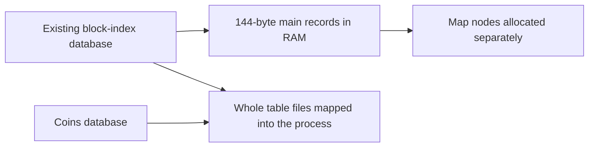
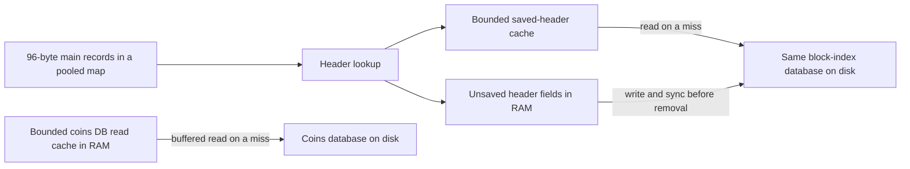

# Feather: less RAM, the same chain data

Feather reduces the memory used by DigiByte's block index and database reads.
It also removes repeated startup work. The block index is the in-memory directory
of known blocks: their parents, chainwork, validation state and disk locations.
With millions of entries, small costs per entry add up.

This document describes the implementation. It does not certify a release or
promise a fixed whole-process RAM limit.

Before Feather:

After Feather:

On the current 64-bit build, the main `CBlockIndex` object is **96 bytes**, down
from **144 bytes**. This excludes map keys, map bookkeeping, caches and separate
allocations. Other platforms or compiler layouts can differ. Check the size
again when changing fields; it is not the RAM cost of the entire node.

The main record keeps the fields used often: parent and skip links, height,
validation status, transaction counts, time, difficulty, work and disk positions.
It still exists in RAM for every known block. Feather does not page the whole
block index out to disk.

The Merkle root is a 32-byte summary of a block's transactions. The nonce is a
4-byte mining field. These **36 bytes** are needed less often, so main records
read them through a shared header source. The fields already exist in the block
index database; there is no new database or storage format.

Sources: [chain.h](src/chain.h), [chain.cpp](src/chain.cpp),
[blockstorage.cpp](src/node/blockstorage.cpp), `BlockTreeDB::ReadBlockHeader`.

Chainwork measures the accumulated proof of work used to compare chains.
`CompactWork` stores values of up to 112 bits inside its 16-byte storage.
Larger values use a separately allocated full 256-bit value. Reads and arithmetic
still use `arith_uint256`. No high bits are discarded and no new work ceiling is
introduced. Large values therefore cost extra memory.

Source: [compact_work.h](src/util/compact_work.h).

The hash map still gives each block record a stable address. Its allocator now
takes space from shared chunks instead of making a separate general-purpose
allocation for every node. This reduces allocation overhead. The chunks must
outlive the map, and the shared header source must outlive its records.

Sources: [blockstorage.h](src/node/blockstorage.h), `BlockMap`;
[pool.h](src/support/allocators/pool.h).

Saved and unsaved headers have different rules:

- The saved-header cache holds at most **65,536 full headers**, plus bookkeeping.
  It checks the requested full block hash and returns an owned copy. Callers do
  not keep cache entries pinned in memory. Missing headers and read errors are
  not cached as successful results.
- Unsaved roots and nonces stay in a separate lookup table in RAM. At 65,536
  entries, normal header processing requests a database flush. This is a flush
  trigger, not permission to discard pending data.
- Pending header fields and dirty-record markers are cleared only after the existing
  synchronous database batch succeeds. A failed write must leave them available.
  Block and undo files are flushed before the index advertises their positions,
  including files belonging to a snapshot chainstate.

An unreadable stored header is a local storage error. Callers must stop the
affected operation rather than invent a header or mark a peer's block invalid
because a local read failed. Allocation failures remain failures too.

Sources: [blockheadercache.h](src/node/blockheadercache.h),
[blockheadercache.cpp](src/node/blockheadercache.cpp),
[blockstorage.cpp](src/node/blockstorage.cpp), `BlockIndexHeaderStore` and
`WriteBlockIndexDB`; [validation.cpp](src/validation.cpp), `FlushStateToDisk`.

Both the block-index database and the coins database now use Feather's
buffered file reader. On POSIX systems it uses `pread`, which reads at a given
offset without moving a shared file position. Windows protects its seek/read
sequence with a lock. LevelDB still checks read lengths and checksums.

These databases target **64 cached table files** each, using `max_open_files=74`
because LevelDB reserves ten slots for other files. Buffered files keep their
handles open, so Unix startup also reserves descriptors for the block index and
up to two chainstates before budgeting peer connections. Active iterators can
hold additional files; the table-cache target is not an absolute descriptor cap.

Ordinary database defaults stay unchanged. Coins database cache resizing and
snapshot initialization preserve the scoped buffered-read settings. The byte
budgets for database caches are not reduced by this change.

Sources: [dbwrapper.h](src/dbwrapper.h), [dbwrapper_env.cpp](src/dbwrapper_env.cpp),
[node/chainstate.cpp](src/node/chainstate.cpp), [txdb.cpp](src/txdb.cpp),
[validation.cpp](src/validation.cpp), `InitCoinsDB`; [init.cpp](src/init.cpp).

Memory-mapped file pages count toward process resident memory, or **RSS**, while
they remain resident. Clean pages can already be reclaimed by the operating
system. Buffered reads avoid whole-table mappings, but the operating system can
still cache those files outside the process. A drop in RSS is therefore not an
equal increase in free system RAM. Heap use, file-backed pages and swap should be
reported separately. `dbcache` controls selected caches, not all process memory.
The main allocation savings come from smaller pooled block records and avoiding
large temporary candidate sets. Buffered reads chiefly change how file pages
are accessed and accounted for; they do not guarantee extra physical RAM savings.

Startup changes reduce work and temporary allocations:

1. Load block-index records once. The old preliminary pass only counted records
   to draw percentage progress. Progress now reports the number loaded, without
   that extra database walk. Iterator errors are checked explicitly.
2. Recover the coins database and its tip before building candidate sets. These
   sets contain blocks eligible to become the chain tip. Building them against
   each recovered chainstate avoids adding a large historical set merely to
   remove most of it later. Fork and snapshot eligibility still matter.
3. Avoid repeated warning scans over complete periods below the existing warning
   height. Those periods cannot contain qualifying warning signals. The period
   crossing that height and later periods still use the existing checker.
   This does not move an activation height or replace consensus checks.

Sources: [blockstorage.cpp](src/node/blockstorage.cpp), `LoadBlockIndexGuts`;
[node/chainstate.cpp](src/node/chainstate.cpp), `CompleteChainstateInitialization`;
[validation.cpp](src/validation.cpp), `RebuildBlockIndexCandidates` and
`WarningBitsConditionChecker::GetStateFor`.

Feather keeps the serialized database records, wire headers, chainwork precision,
consensus rules and Thaw Day activation heights unchanged. The storage changes
do not require a resync or reindex. A damaged database still requires recovery;
Feather is not a substitute for backups or corruption checks.

For future changes, preserve these rules: stable record addresses, correct
source lifetimes, full hash identity checks, pending data until successful sync,
and a clear difference between invalid network data and local storage failure.
Keep the work small. Do not add another database or an eviction scheme for
unsaved records just to reduce a displayed memory number.

Verification must include the full unit and functional suites, sanitizer fuzzing
of compact work and affected arithmetic/header paths, and focused tests for
cache eviction, errors, concurrency, database reopening and descriptor use.
Exercise interruption, failed writes, replay, reorgs, pruning and snapshot roles.
Fuzzing alone does not cover the storage and recovery requirements above.

Measure the final binary on comparable data and workloads. Record peak and
settled RSS, anonymous and file-backed memory, startup time, and identical tip
hash and chainwork. Check header responses and block processing as well. Compare
GUI with GUI; a daemon measurement does not establish desktop memory use.

The first complete verification pass used these source snapshots. Git's directory
hashes identify the exact files even when commits are combined:

- `src`: `0c72ff1eb4daecc69a09623d17056d4e0fe95b2c`
- `test`: `41d600dcb0c65d551e1a6957f2a193f815256df2`

| Check | Result |
| --- | --- |
| Full C++ unit suite | 3,718 cases passed |
| Qt suite on an offscreen display | 163 passes, including setup and cleanup; 3 optional visual captures skipped |
| Full extended functional suite | 391 passed, 17 skipped, no failures |
| Focused memory and undefined-behavior checks | 120 cases and 293,380 assertions passed |
| Fuzz input replay | 85,985 saved inputs across all 255 public targets; no failures |
| Longer fuzz runs | 28 runs passed, including 10 minutes for compact work and one minute per other selected target |

The functional skips cover unsupported signet tests, optional tracing, older
release binaries, and tests requiring special network addresses. A skipped test
is not a passed test. These runs do not establish Windows behavior or physical
power-loss behavior. Full historical reindex and public testnet release checks
remain separate requirements.

One observed desktop startup took about **113 seconds**. Process memory settled
at about **3.67 GiB**, with a peak of **3.82 GiB** and no swap used by that process.
The preceding Feather build used about **4.47 GiB** after startup. This comparison
shows the effect on process memory; the operating-system file-cache caveat above
still applies. These are observations from one workload, not a fixed RAM limit
or a general speed claim.

After history consolidation, rebuild and repeat the full unit, functional, and
fuzz checks on the final release commit. Keep the source identity, commands,
results, and remaining limits with that verification record.
