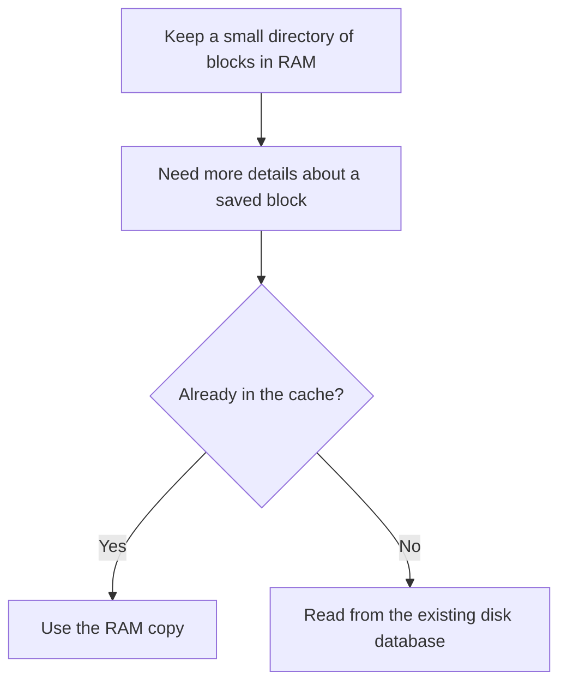

# Feather: how DigiByte uses less RAM

Feather is the name of DigiByte's memory and startup improvements in v9.26.6.
The node keeps smaller records in RAM, reads less-used details from disk when
needed, and does less repeated work when it starts.

## Summary

- **Keep less in RAM.** Details already saved on disk no longer need a permanent
  copy in every block's memory record.
- **Waste less space.** Smaller records and shared memory allocations reduce the
  cost of keeping a directory of millions of blocks.
- **Do less repeated work.** Startup avoids unnecessary counting, large temporary
  lists and repeated processing of oracle prices.
- **Keep the checks.** These changes preserve mining rules, exact work scores
  and checks for missing or damaged data.

One RC1 desktop test used about **3.65–3.67 GiB of RAM** after startup. Starting
that wallet took about **1 minute 48 seconds**. Results depend on the computer,
chain data and workload; they are not a fixed RAM limit or startup time.

**These improvements work as soon as the upgraded program runs.** They do not
wait for Thaw Day. The separate DigiDollar rule changes wait for that height.

## Why a full node needs so much memory

A block is a group of transactions. DigiByte keeps a directory entry for every
known block so it can find the block, check its place in the chain and compare
competing chains. The code calls this directory the **block index**.

There are more than 24 million mainnet blocks. A saving of just 64 bytes per
entry adds up to about 1.43 GiB across 24 million entries.

Feather keeps this directory in RAM. It makes each entry smaller and removes
other unnecessary memory use around it.

## What moved to disk?

The data was already saved on disk. The change is that the node no longer keeps
some of those details in RAM for every block, all the time.

A block's short summary is called its **header**. Two header fields now come
from disk when needed: the summary of its transactions and a number used in
mining. Their code names are `hashMerkleRoot` and `nNonce`.

A **cache** is temporary memory that saves repeated reads. Feather keeps a
limited cache of saved headers. Older entries can be replaced because they
can be read from disk again.

**Unsaved data is different.** New header details stay in RAM until their save
succeeds. A full cache is never permission to discard unsaved data.

## The other memory changes

### 1. Remove eight shortcuts from every block record

Each record used to hold eight pointers to earlier blocks, grouped by mining
algorithm. These were shortcuts for finding a previous block of the same kind.

The node now follows the chain's existing links to find that block. Removing
these pointers saves 64 bytes per record on the measured 64-bit build. The
mining difficulty rules stay the same, including rules for historical Groestl
blocks.

The tradeoff is a little extra lookup work. This particular change saves RAM;
it does not make every lookup faster.

### 2. Store work scores in less space

The node compares valid chains by their total mining work. This number is
called **chainwork**, and its exact value matters.

Feather uses a smaller holder for this number. If a value is too large to fit,
it keeps the full-size value separately in RAM. No digits are rounded away,
and the math still uses the full number.

Together with reading the two header fields from disk, this cuts another
48 bytes from the main block record on the measured build.

| Change | Size of the main record |
| --- | ---: |
| Before the memory work | 208 bytes |
| After removing the eight pointers | 144 bytes |
| After the header and work-score changes | 96 bytes |

This table covers the main record only. The surrounding lookup tables, caches
and other memory still add to the total. Sizes can differ on other builds.

### 3. Give many records space in one larger memory allocation

Asking the system for millions of separate pieces of memory adds bookkeeping
and wasted space. Feather asks for larger chunks and gives each record a piece.
This is called a **memory pool**.

Each record stays in the same place while in use, so links between records keep
working. The lookup table also removes some bookkeeping where the system's
C++ library allows it. The full block identifier is still kept.

### 4. Read the part of a database file that is needed

The block directory and coin database now read requested parts of files into
buffers. Previously, their reader could map whole files into the program's
memory space. The database still checks that the data is complete and intact.

This also changes how the task manager counts memory. The operating system can
still keep recently read file data in its own cache. A lower RAM figure for the
program does not mean every byte of that decrease became free system RAM.

The actual savings from smaller records and fewer temporary allocations are
separate from this change in how file memory is counted. The database cache
budgets were not simply turned down.

### 5. Use a smaller temporary list when checking coins

Some coin records are on disk. Recent changes may still be in RAM. Accounting
checks need both, with the newer information taking priority.

The scan now reads the saved records alongside a sorted copy of the changed
coins. This replaces the extra lookup table used in an earlier version of the
new accounting code. Coins already spent are left out of the result.

The copy is intentional. The working coin cache can change during the scan.
Keeping a stable copy of its changes avoids reading data that moves beneath
the scan. This is a smaller temporary structure, not the removal of a check.

## What makes startup do less work?

| Before | Now |
| --- | --- |
| Walk the block database just to count its entries, then load them | Load them straight away and show how many have been read |
| Build a large list of possible chain ends, then remove most of it | Read the saved chain's last block first, then build the list that is needed |
| Repeat warning calculations for old periods that cannot trigger a warning | Skip those periods; still check the boundary and later periods |
| Repeat parsing and setup for historical oracle price records | Reuse work already done for those records |
| Rebuild completed oracle price history again during the same startup | Use the completed reconstruction |

Oracle services provide signed DGB prices for DigiDollar. Their required price
history is still loaded before startup finishes. Valid competing chains are
still considered when the node builds its list of possible chain ends.

Long scans now show progress and respond to cancellation. Incomplete results
are not marked ready. Required accounting checks still run, including the
check of saved vault totals.

Mining also avoids repeated work. The initial Thaw Day accounting record is
prepared when the preceding block is actually added to the chain. It is not
rebuilt every time a miner asks for a proposed block to mine.

## How saves and reads stay safe

- **Save before forgetting.** Unsaved header details and pending-write records
  stay available if a database write fails.
- **Save in the right order.** Block files and the data needed to reverse blocks
  are saved before the directory records their disk locations.
- **Check what was read.** A stored header must match the block requested.
  Missing or damaged data produces a storage error.
- **Keep errors separate.** A local disk failure is not treated as proof that
  another node sent an invalid block.

Feather keeps the existing block-index file format and network header format.
Its storage changes alone do not require downloading or rechecking the whole
chain. Thaw Day's separate accounting changes have their own recovery checks.

## Why the node still uses several gigabytes

The block directory still has an entry for every known block. The node also
needs memory for coin caches, wallets, pending transactions, network connections
and the work of checking new blocks.

The `dbcache` setting controls only some of those caches. It is not a limit on
the whole program. Feather therefore reduces RAM use without turning a full
DigiByte node into a 200 MB program.

Some operations now do more disk reads or follow more chain links. Startup
removes other work. The total effect on speed depends on the workload and disk.
First sync, recovery and accounting checks after Thaw Day can take longer than
an ordinary restart before it.

## Details for developers and operators

These are the limits and checks behind the design above.

| Item | Detail |
| --- | --- |
| Saved-header cache | Holds at most 65,536 full headers, plus bookkeeping; callers receive their own copy |
| Unsaved headers | Reaching 65,536 entries requests a save; entries remain until that save succeeds |
| Header fields read from disk | A 32-byte transaction summary and a 4-byte mining nonce |
| Work-score storage | A 16-byte holder keeps values up to 112 bits directly; larger values use a separate exact 256-bit number |
| Database file cache | Targets 64 table files per affected database; an active scan can hold more |
| Open-file budget | Startup reserves room for database files before assigning room to peer connections |
| Lookup bookkeeping | Avoids an extra cached hash where supported; full block identifiers remain |
| Unix and Windows reads | Unix uses reads at a given file offset; Windows locks the seek-and-read operation |
| Cache changes and chain snapshots | Keep the same buffered-read settings; block and reversal data are saved before index references |
| Other databases | Keep their existing defaults |

On Unix, a low open-file limit can reduce connections or stop startup. If the
node reports that limit, check the operating system's file allowance.

The recorded desktop run and test results used source commit
`d2097819f260f4d82409643fe9f7263cdd7e3eaa`. That run used no process swap in the
recorded samples. The startup time was 108 seconds; it was not a measurement
of the future Thaw Day accounting scan.

Recorded checks included 3,739 passing unit tests and 394 passing functional
tests, with 17 functional tests skipped and none failed. Separate desktop,
memory-error and fuzz checks are recorded with the release tests. A skipped
test is not a pass. Full mainnet replay and public activation checks remain
separate release requirements.

Future changes need tests for exact work scores, historical mining rules,
cache replacement, failed reads and writes, simultaneous reads, restarts,
pruning and chain changes. Compare the accepted block and work score as well
as RAM use. Measure the same workload on both builds.

| Code area | Files |
| --- | --- |
| Block records and saved headers | [chain.h](src/chain.h), [chain.cpp](src/chain.cpp), [blockstorage.cpp](src/node/blockstorage.cpp) |
| Mining lookups | [pow.cpp](src/pow.cpp), [lookup tests](src/test/pow_algo_lookup_tests.cpp) |
| Work scores | [compact_work.h](src/util/compact_work.h), [work-score tests](src/test/compact_work_tests.cpp) |
| Shared memory allocations | [blockstorage.h](src/node/blockstorage.h), [pool.h](src/support/allocators/pool.h), [hasher.h](src/util/hasher.h) |
| Header cache | [blockheadercache.cpp](src/node/blockheadercache.cpp), [cache tests](src/test/blockheadercache_tests.cpp) |
| File reads | [dbwrapper.h](src/dbwrapper.h), [dbwrapper_env.cpp](src/dbwrapper_env.cpp), [reader tests](src/test/dbwrapper_env_tests.cpp) |
| Coin scans | [coins.cpp](src/coins.cpp) |
| Startup and saving | [chainstate.cpp](src/node/chainstate.cpp), [validation.cpp](src/validation.cpp), [init.cpp](src/init.cpp) |
| Oracle prices and health | [bundle_manager.cpp](src/oracle/bundle_manager.cpp), [health.cpp](src/digidollar/health.cpp) |
