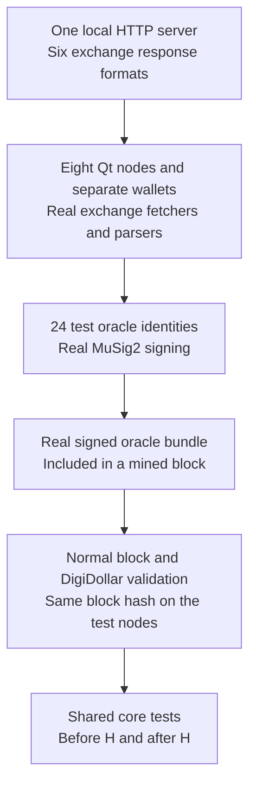

# Thaw Day test guide

`thawDay.sh` runs the same core DigiDollar checks before Thaw Day and after it
on a private network on this computer. It opens separate Qt wallets and uses
a separate test client. The main test is that the intended rules change at the
boundary while mint, send, receive, redeem, and wallet recovery still work.

- Eight Qt nodes host eight new wallets and 24 test oracle identities.
- Local price responses pass through real parsers, signing, bundles, and validation.
- The lab activates Thaw Day at 5,000; the release's public heights stay unchanged.
- Windows and the local price server stay open by default for inspection.
- Execution results are PENDING in the table below; this guide claims no full-run PASS.

## How the test works

An oracle is a signer that helps agree on a DGB price. MuSig2 combines the chosen
signers' signatures into one. A bundle is the signed price record put in a block.
The lab supplies prices; the client must still parse, sign, include, and validate them.



The server returns the JSON formats used by Binance, CoinGecko, KuCoin, Gate.io,
HTX, and Crypto.com. These are six local routes, not real exchange connections.
Its log records the routes actually requested. A feed response, signed heartbeat,
and signed price in a mined block are separate evidence.

Bob, Alice, Charlie, Dave, Eve, Frank, Grace, and Heidi are the eight starting
wallets. The 24 oracle identities are spread across their Qt processes. A later
fresh-sync check opens a ninth Qt node with empty data and no assigned oracle.

## The lab and release settings

`H` is the first block height that uses the new Thaw Day rules. The private lab
uses H=5,000 and DigiDollar activation at 600 in the existing `-easypow` test mode.
The release values remain mainnet **24,490,000** and testnet26 **432,100**.
The lab's P2P network marker is `f9 dd a5 66`; it connects only to local peers.

The separate client is in `builds/thawday-client`, built from the v9.26.6rc2
commit. The rc1 lab client and its evidence are kept in `builds/thawday-client-rc1`.
Its patch changes lab network settings, startup guards/banner, and exchange URL routing. DigiDollar validation,
accounting, C1/C2/C3, exchange parsers, aggregation, signing, and signature checks
remain in place. There is no validation bypass. Easy test mining does not prove
public-network difficulty behavior.

Startup requires testnet, `-easypow`, `THAWDAY_LAB=1`, and an exact feed URL of
`http://127.0.0.1:<port>`. The script supplies them. Feed requests disable public
fallback, proxies, and redirects. An unavailable local server means a failed fetch.
Each node uses local RPC/P2P bindings, its own ports, disabled public discovery,
a new data folder, and private Qt preferences. The nested folder name `testnet26`
does not make these fresh private data folders public-chain data.

Oracle keys are known test keys; wallets are new and their mined coins have no
public-chain value. Do not put real funds, keys, or public-chain data in this client.
The old script, existing wallets, release binaries, live nodes, and running
mainnet/testnet reindexes remain separate and untouched.

## Build, run, inspect, and stop

Use a Linux desktop with a working `DISPLAY`, Python 3, the project's Qt 5 build
dependencies, and enough free memory/disk for the small nodes. Process checks use
Linux `/proc`. Run these commands from the release checkout:

```sh
cd /home/jared/Code/digibyte
```

Build the separate client only if its worktree does not already exist:

```sh
./thawDay.sh build
```

This creates a **fresh** `builds/thawday-client`, applies
`contrib/thawday/client.patch`, and builds daemon, CLI, and Qt with `make -j8`.
It refuses to overwrite an existing worktree. The delivered workspace may already
contain the build; use it in that case. The build does not run the full test suites.
Keep one heavy job at a time and leave existing builds/reindexes alone.

Start a new run:

```sh
./thawDay.sh run
```

The default is a new timestamp folder under `builds/thawday-runs/`. Save the exact
path printed by the script. It refuses to reuse an existing folder. To choose one:

```sh
./thawDay.sh run --run-dir /home/jared/Code/digibyte/builds/thawday-runs/my-new-run
```

The script checks its client build record, patch, source, and binary hashes before
launch. Review any mismatch; do not edit hashes to get past the check. Wallets
are named `thaw-test-bob`, `thaw-test-alice`, and so on. Files and Qt preferences
stay inside the private run folders rather than your normal wallet/settings paths.

By default, Qt and the price server stay open when the command ends, including
after a failed check. To close only this run's processes automatically, use:

```sh
./thawDay.sh run --close-after
```

From another terminal, inspect or stop the run using its actual path:

```sh
./thawDay.sh status --run-dir /home/jared/Code/digibyte/builds/thawday-runs/20260914-143000
./thawDay.sh stop --run-dir /home/jared/Code/digibyte/builds/thawday-runs/20260914-143000
```

Replace the example timestamp. `status` prints saved `run.json`; it does not run
a fresh health check. `stop` uses the saved process IDs, start times, and private
RPC ports. It does not stop processes by a broad name match. Evidence and test
wallets stay on disk after stopping.

## The shared before/after checks

The workflow follows `test_multi_oracle_testnet.sh` but does not run that script.
One shared `core_suite` runs on each side of H. The script mines to 3,000, funds
fee balances, starts the oracles, and waits for signed heartbeats before the first
group. Mining limits and actual confirmation heights keep that group below H.

Each group confirms twelve 100-DD mints: one at each of the ten lock tiers plus
two more tier-0 vaults for later checks. It first tries an early tier-0 redemption.
For valid redemptions it waits until one block beyond the greatest **returned
unlock height** of the needed vaults, rather than assuming a fixed block count.

Transfers run Bob → Alice → Charlie → Bob, with each balance checked. The group
rejects partial redemption, confirms a whole-vault redemption, rejects a second
spend of that vault, and exercises an extra burn. It then checks accounting and
restarts, backs up, restores, and rescans Bob and Alice's wallets.

For the extra burn, the script builds a normal redemption and keeps it off the
network. It reduces the returned token change by 25 DD, then signs the changed
transaction again with the correct test keys. Only that replacement is sent.
Closing a 100-DD vault burns 125 DD but removes only 100 DD of open principal.
The script checks that the replacement confirms and the original cannot spend
the same vault afterward. It does this once before H and once after H.

Bob is the miner, and the extra-burn step restarts Bob. A restarted miner starts
its oracle signing session over, and a block that carries a mint or redemption
must include a fresh signed price. So after any restart of Bob, the script only
calls the price ready once a block mined after that restart carries a signed
price. The first full rehearsal stopped here because it mined twelve blocks in
twenty seconds while Bob's signers were still starting, and Bob left the
redemption out of every block. Before the replacement is sent, an ordinary DGB
payment confirms as a control, and the script records Bob's block template to
show the replacement is in it.

After the pre-Thaw group, Bob reindexes with its wallet loaded and must reach
the same block hash with the same DD balance. Bob's wallet holds addresses that
received change after a mint, which is the case that broke the rc1 reindex on
mainnet. Bob reindexes again at the end of the run, before Heidi.

Circulating DD means issuance minus the DD actually burned. Open-vault principal
means the original DD minted against vaults still open. An extra burn reduces
circulation by more than the principal removed; those totals can validly differ.
Below H the legacy health denominator remains selected. At/after H, health uses
open-vault principal, without recreating the extra tokens burned.

The ledger checks the saved transaction bytes and asks which token and vault
outputs remain unspent. It independently totals token amounts, original principal,
collateral, and vault count before comparing them with node reports. Post-H it
also checks the saved health record's block hash/readiness, matches records
across nodes, requires a ready candidate view, and checks its health calculation.

## Activation, replacement branches, and price limits

The price starts at $0.030000 per DGB, then rises to $0.045000. Prices are stored
in micro-USD, one millionth of a dollar: 30,000 and 45,000. The script checks that
a fresh signed quote still hits the old freeze, then mines signed ancestor samples.
At tip H-2 the next block is still pre-H. At tip H-1 the next block is H and uses
new rules. At H the script checks the 15-sample reference and cleared old freeze.
The after-H core group must then actually confirm its eligible mints.

A reorg replaces part of the active chain with another branch. The boundary test
rewinds a follower below H, restarts it, and reconnects the original blocks. It checks
the restored UTXO MuHash, a compact digest of all unspent outputs. It then creates
a short replacement branch with more work and submits its real block bytes to
the other nodes through normal validation. Nodes must choose the replacement
branch and agree on accounting. This short reorg does **not** replace the older
price-sample ancestors and does not prove deep sample-changing reorg behavior.

With the reference held at 45,000 micro-USD, the price checks use 54,000 and
36,000: exactly 20% above and below. Mints must reject at both edges, while an
otherwise valid send and eligible ordinary redemption must confirm. At 53,999
and 36,001, just inside those edges, actual mints must confirm. The script checks
that the reference stayed fixed, then restores the 45,000 price.

Heidi finally reindexes the small lab chain; a ninth node syncs from empty data.
The nodes must reach the same block hash and satisfy the ledger checks. Alternating
starting nodes have the DD stats index on/off. This is not every index/pruning mode.

## Execution status

Run `rc2-rehearsal-09` completed the whole integrated harness with no failed
check. It used the test client built from the v9.26.6rc2 commit `e3ad0a4522`
(daemon sha256 `16e127189d75`), reached final height **5,658** with tip hash
`0000073bc7d85ac72c80328c6e17ba26aabd9cc2d4f907c94cba6c4113e5856c`, and recorded
143 checks with zero failures. The evidence is under
`builds/thawday-runs/rc2-rehearsal-09/`. A pass here is the lab exercise only; it
does not replace the separate audit, public testnet activation and observation,
the older-binary comparison, or the full mainnet history reindex.

| Check | Before H | At/after H |
| --- | --- | --- |
| Twelve mints covering all ten tiers | PASS | PASS |
| Early/partial/repeated redemption rejection | PASS | PASS |
| Confirmed send/receive and exact balances | PASS | PASS |
| Whole-vault redemption and extra burn | PASS | PASS |
| Direct token/vault ledger and selected health rules | PASS | PASS |
| Bob/Alice restart, backup, restore and rescan | PASS | PASS |
| Bob reindex with its wallet loaded, same hash and balance | PASS | PASS |
| Legacy freeze and H-1/H rule selection | PASS | PASS |
| Boundary rewind, restart, reconnect and replacement branch | PASS | PASS |
| Both exact 20% mint rejections; send/redeem stay usable | Not a pre-H C1 rule | PASS |
| Actual mints just inside both price edges | Not a pre-H C1 rule | PASS |
| Lab reindex and fresh sync to the same hash | Separate end-of-run check | PASS |

## Qt inspection, evidence, and limits

Automation uses RPC, the program interface, while real Qt wallets run. It does
not click every GUI form. Inspect balances, positions, transaction history, fees,
collateral, and error/status messages during the printed `before` and `after`
phases. Manual flows and screenshots are separate evidence: record the run,
build, phase, and transaction. There is no automatic pause for every screen.

Keep the whole run folder. `run.json` records the build, ports, processes, status,
and final hash/height if completed; `results.jsonl` records individual checks.
Also keep `test-client.patch`, `ancestor-samples.json`, `feed-requests.jsonl`,
`price-micro-usd.txt`, console/node logs, test wallets and backups. The separate
client has `THAWDAY_BUILD.json`. The run records the old script's hash without
executing it. A missing later check record is not a PASS.

Preserve errors and logs. A failed check may be a harness defect, missing
prerequisite, timeout, or product defect; the message alone does not decide which.
Use the run's `stop` command for cleanup and a new folder for another attempt.
Do not weaken validation or change an expected answer to make a check pass.

Even a complete lab PASS does not replace the separate audit, full current test
suites, real older-binary comparison, full historical mainnet/testnet reindex,
public testnet observation periods, or operator coordination. It does not cover
every attack, crash, storage fault, deep reorg, platform, or resource limit.
The same client before/after H is not a mixed-version test; lab reindex is not
public-history reindex; heartbeats alone do not prove every signer joined mined
bundles; and open Qt windows do not prove every GUI action was used.
